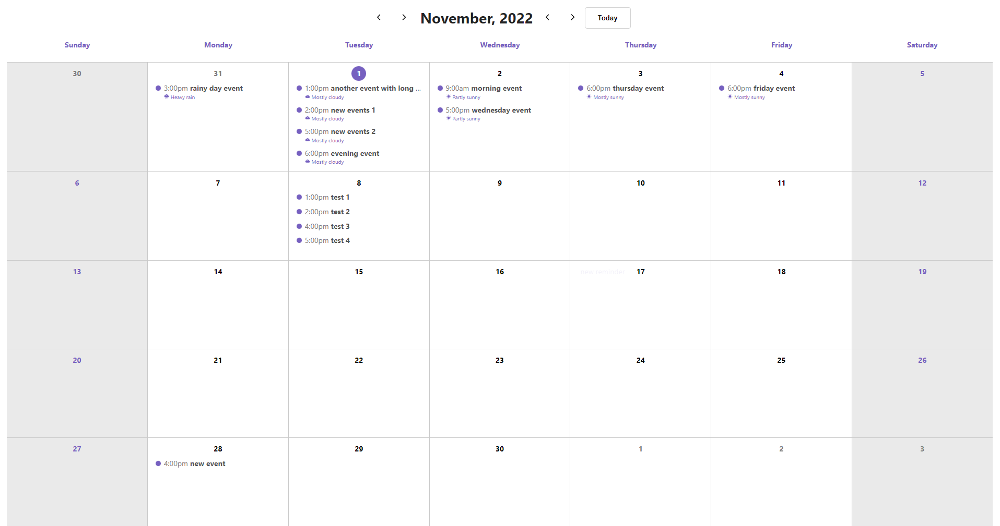

    

# React Challenge

- Added `typescript`, `jest`, `@reduxjs/tookit`, `axios`, `polished`, `date-fns` and `styled-components` as additional dependencies.
- The unit tests are implemented on file `ReminderModal.spec.tsx`.
- To add a new reminder, simply click on any day cell on the calendar.
- Any reminder can be edited or deleted by clicking on them on any day cell.
- The forecasts are added below the reminders on the day cells. For a forecast to appear, the reminder must be at most 5 days distant forward from now.
- When there are more than 4 reminders, the rest are only available through a modal that is accessed by the button `see more`, that appears when hovering a date cell on the calendar.
- The feature to change months and years are accessed through the arrows on the header.
- `@reduxjs/tookit` uses `Immer` to allow object mutations when writing reducers (but actually new objects are created by Immer).

    

## How to deploy

- Run `npm install` | `yarn install` to install all dependencies.
- Run `npm start` | `yarn run` to run the app locally.
- You can find the project running on `localhost:3000`.
